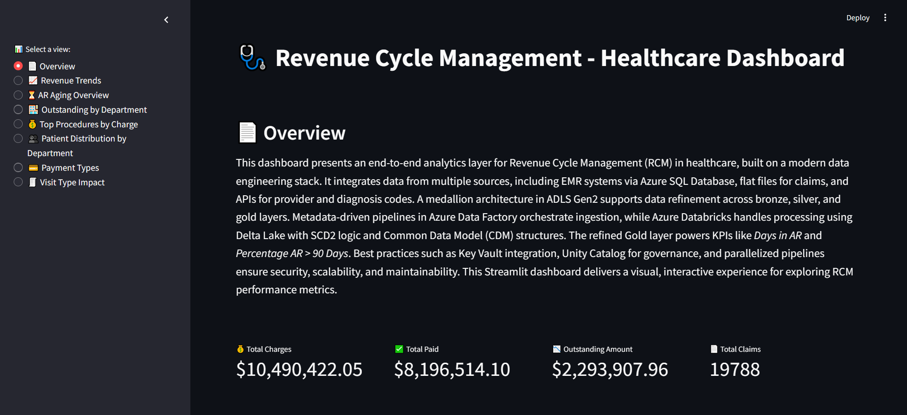
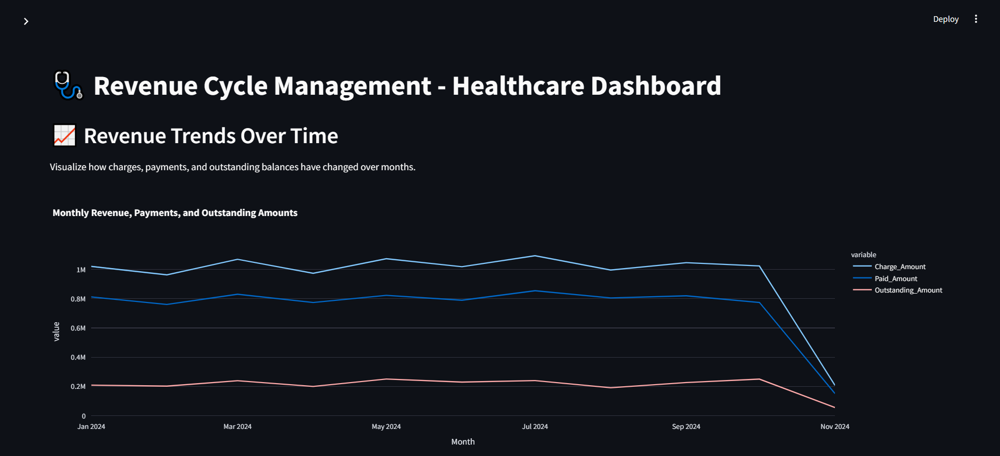
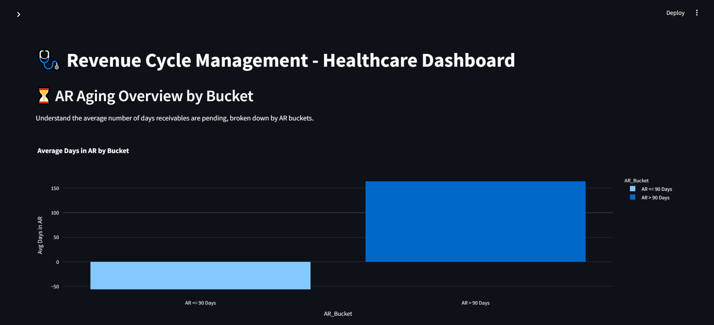
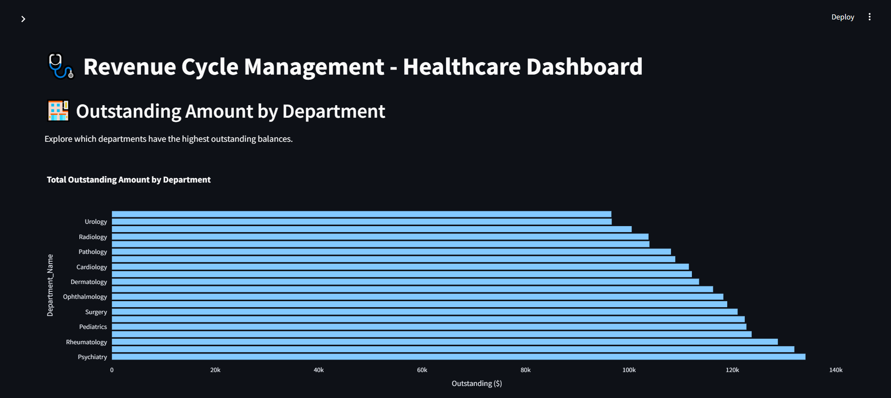
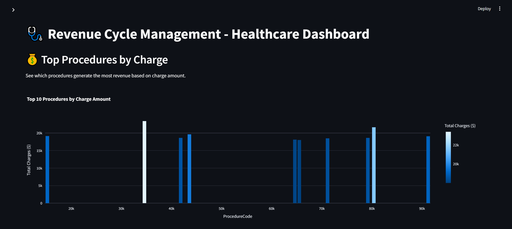
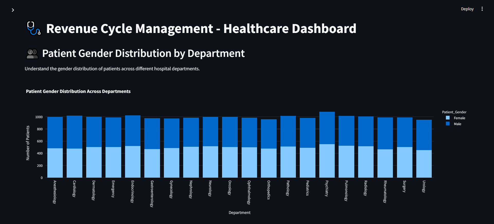
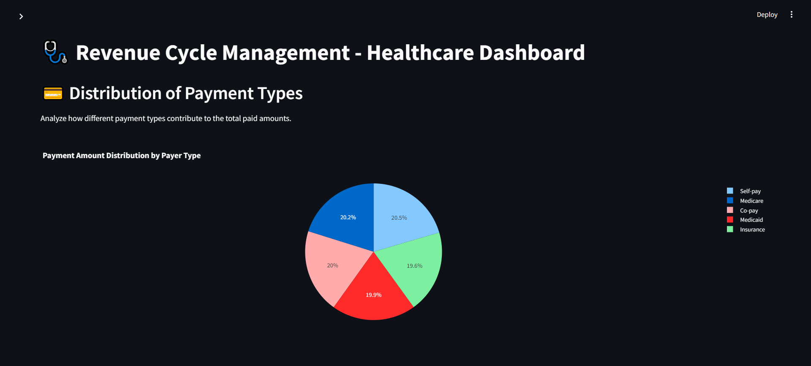

## 🩺 RCM - Healthcare Streamlit Dashboard

This project presents **Streamlit Dashboard** for Revenue Cycle Management (RCM) in healthcare.

### 🚀 Project Summary

An end-to-end Azure Data Engineering pipeline was implemented to support healthcare RCM analytics. Data was ingested from multiple sources including.
- **Azure SQL DB** for EMR data
- **Flat files** for claims
- **APIs** for NPI and ICD code enrichment

A **medallion architecture** was used in **ADLS Gen2**, with ingestion orchestrated via **Azure Data Factory**. Data transformation and processing was done in **Azure Databricks**.

The refined **Gold Layer** produced analytical fact and dimension tables, which powered this interactive Streamlit dashboard showing KPIs.

### 📊 Features in the Dashboard

- 📄 **Overview** – Project summary + KPI metrics
 

- 📈 **Revenue Trends** – Charges, payments & outstanding over time

 
- ⌛ **AR Aging Overview** – Avg. Days in AR by bucket

 
- 🏥 **Outstanding by Department** – Top departments by AR

  
- 💰 **Top Procedures by Charge** – Highest revenue-generating procedures

  
- 🧍‍♀️ **Patient Distribution by Department** – Gender-based patient counts

  
- 💳 **Payment Types** – Payment distribution by payer type

 
- 🩺 **Visit Type Impact** – Financial metrics by visit type

