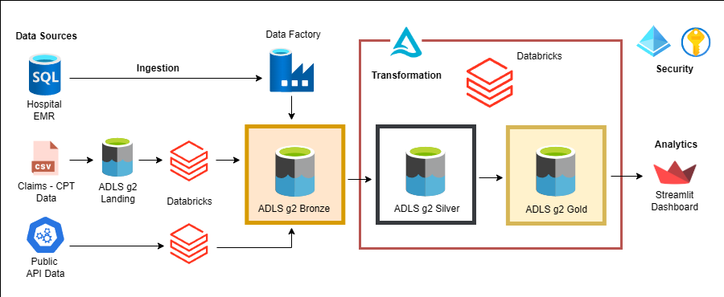

## Revenue Cycle Management - Healthcare Pipeline

**RCM Healthcare Pipeline** is a scalable, cloud-native data engineering project that simulates a real-world Revenue Cycle Management (RCM) solution for healthcare providers. It involves building an end-to-end data pipeline to ingest, transform, and serve data from hospitals, insurance companies, and public health APIs. It captures the financial flow from patient scheduling to provider payment, leveraging the Azure data stack to build a robust and maintainable data pipeline. 
The project follows the medallion architecture **Landing → Bronze → Silver → Gold** and uses Azure Data Factory for orchestration, Delta Lake for ACID-compliant storage, and Azure Databricks for transformation. The solution integrates **Unity Catalog** for centralized data governance and Azure Key Vault for secure secret management. Finally, a Streamlit dashboard built on top of the gold layer presents business KPIs and insights.

---

### 🛠️ Tools & Technologies Used:

 

 

---

### 📊 Architecture & Workflow

---

### 📑 Dataset Description

- **EMR Data** (Azure SQL DB): Departments, Patients, Providers, Encounters, Transactions  
- **Claims Data**: Insurance claim CSVs (monthly)  
- **NPI / ICD / CPT Codes**: Public API + flat file sources

> ⚠️ Note: All data is synthetic and generated using Faker for learning purposes. No real patient or provider data was used.

---

### 🚀 Engineering Process

1. **Data Sources**:
   - Azure SQL DB (Hospital A & B)
   - ADLS Flat Files (Claims, CPT)
   - APIs (ICD, NPI)

2. **ADF Ingestion Pipelines**:
   - Metadata-driven config
   - Full and incremental support via watermarking
   - Logs to audit Delta table

3. **Databricks Transformations**:
   - Bronze → Silver: CDM, SCD Type 2, quality checks
   - Silver → Gold: Analytical facts & dimensions

4. **Streamlit Dashboard**:
   - Connected to gold layer output
   - Visualized Business KPIs

---

### 🔐 Security & Governance

- **Azure Key Vault**: Centralized secret management
- **Unity Catalog**: Cross-workspace table access and RBAC
- **Delta Lake**: Used for ACID-compliant data updates and versioning

---
